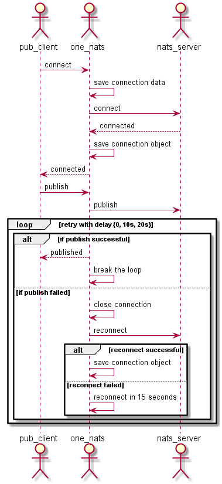
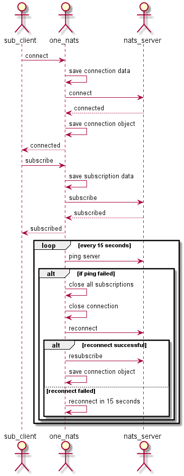

# one-nats
One-Nats is an imporved nats streaming library, it's a wrapper on the top of the nats streaming client to handle the following three situlations:
1. When nats server is not available when client is connecting to server
1. When nats server is restarted after client subscribed to server
1. When nats server is not available when client is publishing message

# Sequence diagram
## Publisher 


## Subscriber


# Usage
## go
### Publisher
```go
package main
import nats "github.com/d3sw/one-nats/go"
func main() {
	nats.Connect("nats://localhost:4222", "test-cluster", "pub_client")
	nats.Publish("foo_subject", []byte("foot_message"))
	nats.Close()
}
```
### Subscriber
```go
import (
	"fmt"
	"log"
	nats "github.com/d3sw/one-nats/go"
	"github.com/nats-io/go-nats-streaming"
)
func main() {
	nats.Connect("nats://localhost:4222", "test-cluster", "pub_client")
	nats.QueueSubscribe("foo_subject", "foo_queue", "foo_durable", func(msg *stan.Msg) {
		log.Printf("Received on [%s]: '%s'\n", msg.Subject, msg)
	})
	fmt.Scanln()
	nats.Close()
}
```

## CSharp
For CSharp project, the nats client project needs to import the one-nats nuget package:
nuget server: http://nuget.service.owf-dev:5000
package ID: Deluxe.One.Nats

### Publisher
```csharp
using System;
using System.Text;
using Deluxe.One.Nats;
namespace ConsoleApp1
{
    class Program
    {
        static void Main()
        {
            nats.Connect("nats://localhost:4222", "test-cluster", "pub_client");
            nats.Publish("foo_subject", Encoding.UTF8.GetBytes("message"));
            nats.Close();
            Console.ReadLine();
        }
    }
}
```
### Subscribler
```csharp
using System;
using System.Text;
using Deluxe.One.Nats;
namespace ConsoleApp1
{
    class Program
    {
        static void Main()
        {
            nats.Connect("nats://localhost:4222", "test-cluster", "pub_client");
            nats.QueueSubscribe("foo_subject", "foo_queue", "foo_durable", (sender, args) =>
            {
                Console.WriteLine("received message: {0}", Encoding.UTF8.GetString(args.Message.Data));
            });
            Console.ReadLine();
            nats.Close();
        }
    }
}
```

## java
